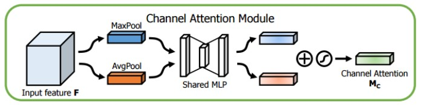
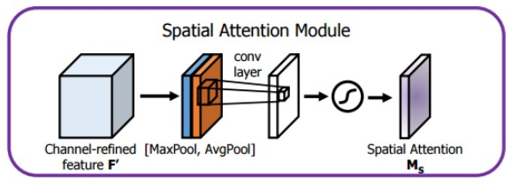

# CBAM: Convolutional Block Attention Module [[1](https://arxiv.org/abs/1807.06521)] (Tensorflow) 

## Channel Attention Module (CAM)
Produce a channel attention map using the inter-channel relationship. Like explain in associated article, the idea is search > 'what' is meaningful given an input image.
For that he compute the CAM as follow:
$$M_c(F) = \sigma(\text{MLP}(AvgPool(F)) + \text{MLP}(MaxPool(F)))$$

## Spatial Attention Module (SAM)

$$M_s(F) = \sigma(f^{n*n}([AvgPool(F);MaxPool(F)]))$$

## Convolution Block Attention Module (CBAM)

## References
[[1](https://arxiv.org/abs/1807.06521)] Sanghyun Woo,Jongchan Park, Joon-Young Lee, and In So Kweon. CBAM: Convolutional Block Attention Module. 2018.
